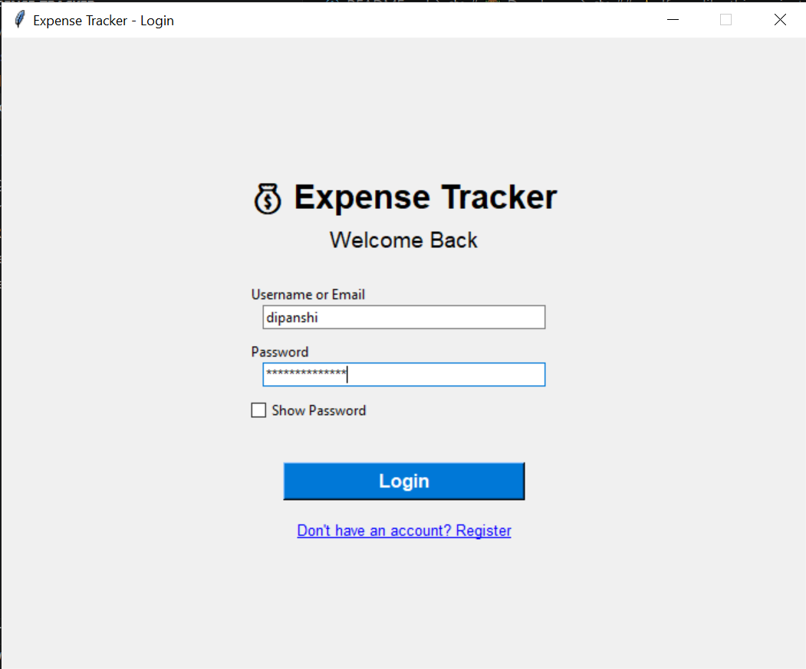
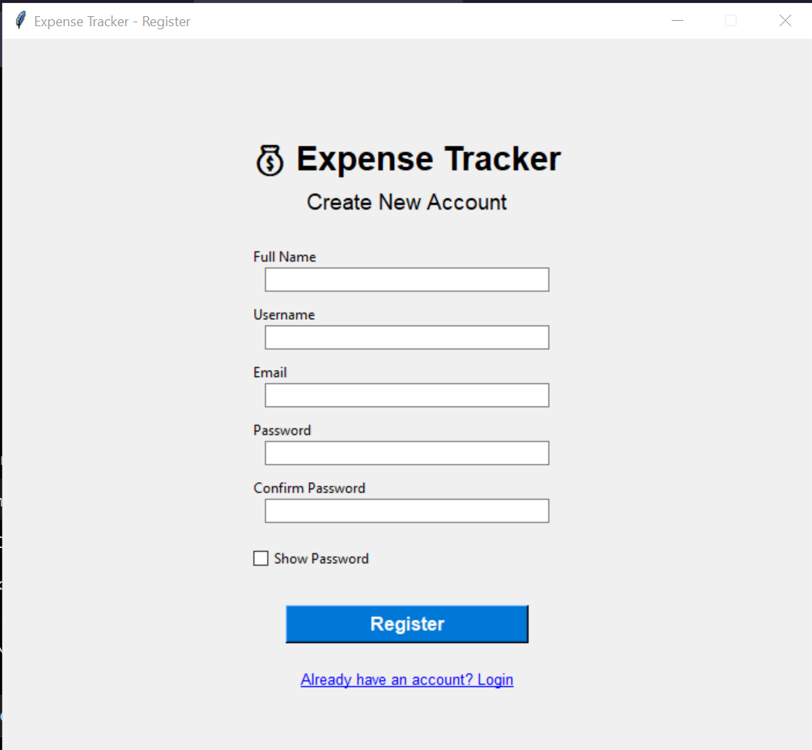
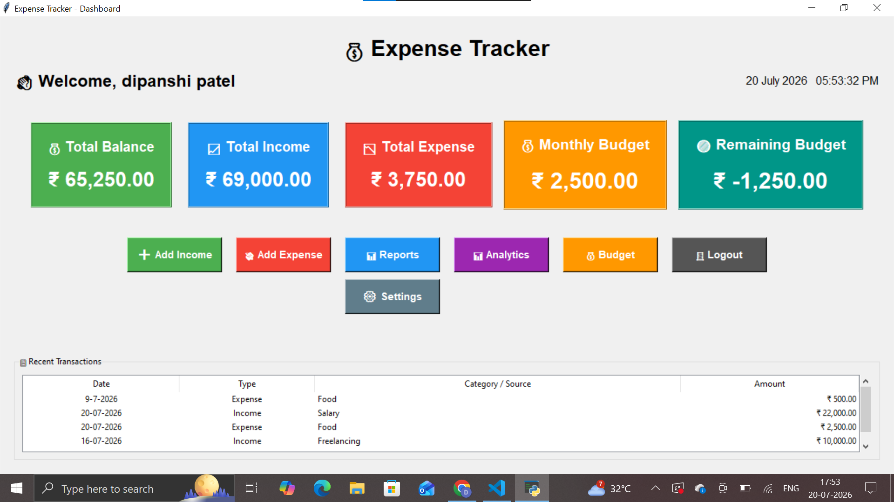
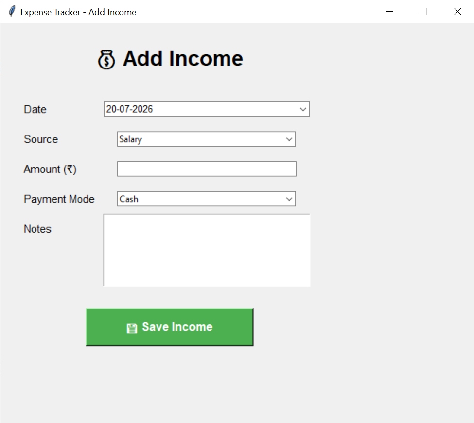
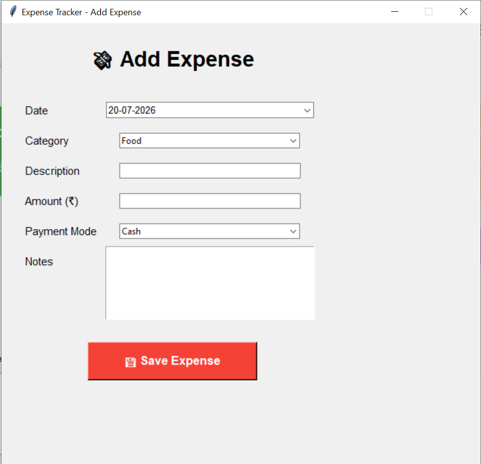
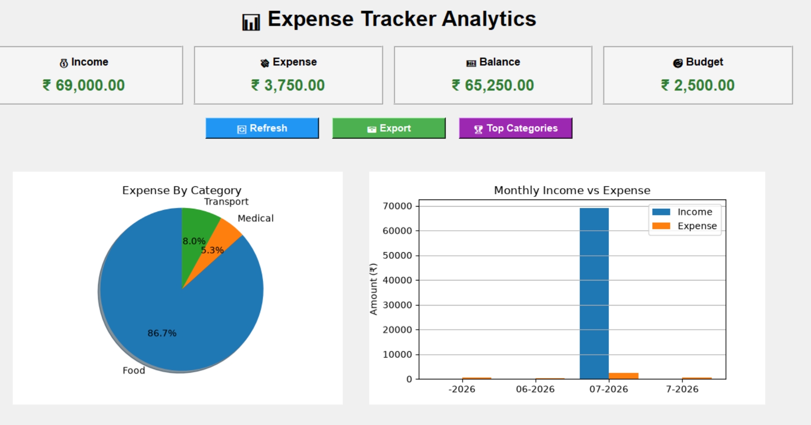
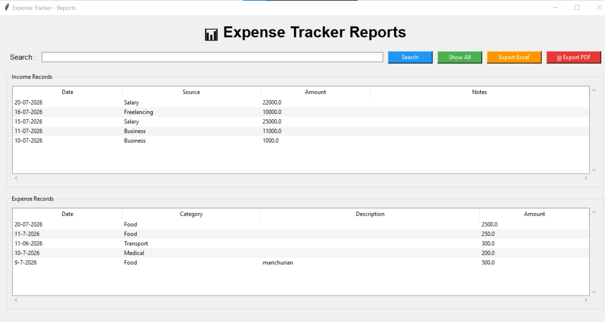
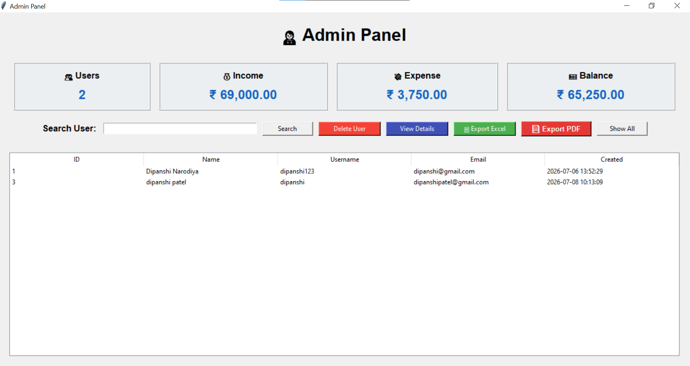

# 💰 Expense Tracker Desktop Application

A modern desktop-based Expense Tracker built using **Python**, **Tkinter**, **SQLite**, and **Matplotlib**.

This application helps users manage their daily income, expenses, monthly budgets, reports, analytics, and user profiles through a simple and attractive graphical interface.

---

# 📌 Features

### 🔐 Authentication
- User Registration
- Secure Login
- Change Password
- Edit Profile

### 💵 Income Management
- Add Income
- Edit Income
- Delete Income
- Multiple Income Sources

### 💸 Expense Management
- Add Expense
- Edit Expense
- Delete Expense
- Expense Categories

### 🎯 Budget Management
- Set Monthly Budget
- Remaining Budget Calculation

### 📊 Reports
- PDF Export
- Excel Export
- Monthly Reports

### 📈 Analytics
- Expense by Category
- Monthly Summary
- Income vs Expense Charts
- Savings Analysis

### 👨‍💼 Admin Panel
- View Registered Users
- Delete Users
- Export User List

---

# 🛠 Technologies Used

- Python 3
- Tkinter
- SQLite
- Matplotlib
- OpenPyXL
- ReportLab

---

# 📂 Project Structure

```text
expense_tracker/
│
├── assets/
├── database/
├── screenshots/
├── ui/
├── utils/
├── main.py
├── requirement.txt
└── README.md
```

---

# 🚀 Installation

Clone the repository

```bash
git clone https://github.com/dipanshi-narodiya/Expense-Tracker-Desktop-App.git
```

Go inside the folder

```bash
cd Expense-Tracker-Desktop-App
```

Install dependencies

```bash
pip install -r requirement.txt
```

Run the application

```bash
python main.py
```

---

# 📷 Application Screenshots

## 🔐 Login Page



---

## 📝 Register Page



---

## 🏠 Dashboard



---

## 💰 Income Management



---

## 💸 Expense Management



---

## 📈 Analytics



---

## 📄 Reports



---

## 👨‍💼 Admin Panel



---

# 🔮 Future Improvements

- Dark Mode
- Email Notifications
- Cloud Database
- Mobile Application
- AI Expense Prediction
- Multi-language Support

---

# 👩‍💻 Developer

**Dipanshi Narodiya**

GitHub:
https://github.com/dipanshi-narodiya

---

## ⭐ If you like this project, don't forget to Star the repository!