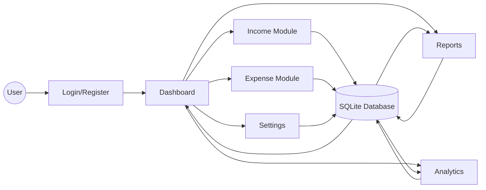

# Expense Tracker DFD

```mermaid
flowchart LR

User((User))

Login[Login/Register]
Dashboard[Dashboard]
Income[Income Module]
Expense[Expense Module]
Reports[Reports]
Analytics[Analytics]
Settings[Settings]
DB[(SQLite Database)]

User --> Login
Login --> Dashboard

Dashboard --> Income
Dashboard --> Expense
Dashboard --> Reports
Dashboard --> Analytics
Dashboard --> Settings

Income --> DB
Expense --> DB
Reports --> DB
Analytics --> DB
Settings --> DB

DB --> Reports
DB --> Analytics
DB --> Dashboard
```